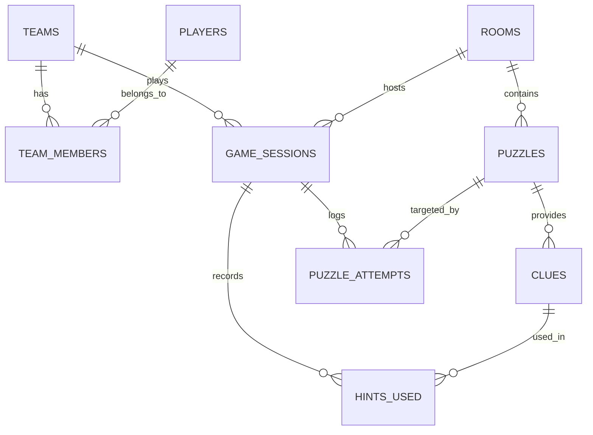

# 🔐 Escape Room: Database-Driven Mystery Game

A full-stack, database-backed desktop Escape Room application built with **Python (Tkinter GUI)** and a **MySQL relational database**. Developed as a **Semester 3 Database Management Systems (DBMS)** project.

---

## 🌟 Key Features

- **3 High-Detail Themed Escape Rooms**:
  - 🏚️ *The Haunted Manor* (Horror • Hard • 30 mins)
  - 🏛️ *The Lost Temple* (Adventure • Medium • 25 mins)
  - 🚀 *Space Station Omega* (Sci-Fi • Hard • 30 mins)
- **15 Solvable Puzzles with Visual Clues**: 5 sequential stages per room featuring high-resolution atmospheric illustrations, riddles, ciphers, anagrams, and telemetry data.
- **Dynamic Hints System**: 30 hints with graded point penalties tracked in real-time in MySQL.
- **Team & Player Roster Management**: Create new teams with multiple players or select existing squads.
- **Real-time Session Engine**: Tracks active attempts, answers submitted, elapsed time, escape status, and final scores.
- **Hall of Fame Leaderboard**: Driven by a custom MySQL View calculating escape count, high scores, and averages.
- **In-Game Forfeit Controls**: Safe exit option that prevents orphaned active database sessions.

---

## 🏗️ System Architecture & ER Diagram

The database enforces 3NF normalization, foreign key constraints with cascading deletes, and aggregate views.



### Relational Schema Summary

| Table | Description | Primary Key | Foreign Keys |
| :--- | :--- | :--- | :--- |
| `rooms` | Escape room definitions, themes, difficulties, time limits | `room_id` | — |
| `puzzles` | Room-specific stages, riddles, correct answers, points, `image_path` | `puzzle_id` | `room_id` -> `rooms` |
| `clues` | Progressive hints with point penalties | `clue_id` | `puzzle_id` -> `puzzles` |
| `teams` | Team profiles | `team_id` | — |
| `players` | Individual player accounts | `player_id` | — |
| `team_members` | Many-to-many link between teams and players | `(team_id, player_id)` | `teams`, `players` |
| `game_sessions` | Individual gameplay attempts, status (`ACTIVE`, `ESCAPED`, `FAILED`), score | `session_id` | `team_id`, `room_id` |
| `puzzle_attempts` | Audit log of submitted answers and timestamps | `attempt_id` | `session_id`, `puzzle_id` |
| `hints_used` | Record of hints unlocked and points deducted | `hint_usage_id` | `session_id`, `clue_id` |
| `leaderboard` (VIEW) | Dynamic aggregation of total games, escapes, best score, avg score | `team_id` | — |

---

## 🚀 Getting Started

### Prerequisites

- **Python 3.10+**
- **MySQL Server 8.0+** running locally (or remotely)

### 1. Install Dependencies

Install the required Python packages:

```bash
pip install -r requirements.txt
```

*(Packages: `mysql-connector-python>=8.0.0`, `Pillow>=10.0.0`)*

### 2. Configure Database Credentials (Optional)

By default, [database.py](database.py) connects to:
- **Host**: `127.0.0.1` (Port: `3306`)
- **User**: `root`
- **Password**: `titimylove`
- **Database**: `escape_room`

You can override any parameter using environment variables:
```bash
export DB_HOST="127.0.0.1"
export DB_USER="root"
export DB_PASSWORD="your_mysql_password"
export DB_NAME="escape_room"
```

### 3. Initialize / Seed the Database

Run the automated initializer to execute [schema.sql](schema.sql), create all tables, seed all 3 rooms, 15 puzzles, 30 clues, and default teams:

```bash
python3 init_db.py
```

### 4. Launch the Game

Start the desktop application:

```bash
python3 main.py
```

---

## 🎮 How to Play & Controls

1. **Main Menu**:
   - **Start Game**: Proceed to team setup and room selection.
   - **How to Play**: Review game rules and scoring mechanics.
   - **Leaderboard**: View rankings, escape statistics, and high scores.
   - **Exit**: Quit application.
2. **Keyboard Shortcuts**:
   - `Esc`: Exit fullscreen mode.
   - `F11`: Toggle fullscreen mode on/off.
   - `Enter`: Submit answer on active puzzle.
3. **In-Game**:
   - Answer entry is case-insensitive.
   - Click `💡 HINT` if stuck (deducts points from final score).
   - Click `🏳️ Forfeit` to cancel and return to menu cleanly without leaving orphaned database sessions.

---

## 🧪 Puzzle Solutions Reference (Evaluation Guide)

| Room | Puz 1 | Puz 2 | Puz 3 | Puz 4 | Puz 5 |
| :--- | :--- | :--- | :--- | :--- | :--- |
| **1. The Haunted Manor** | `1843` | `MIDNIGHT` | `RAVEN` | `SHADOW` | `WILLOW` |
| **2. The Lost Temple** | `4321` | `LOTUS` | `ORACLE` | `TEMPLE` | `GOLD` |
| **3. Space Station Omega** | `OMEGA` | `7391` | `OXYGEN` | `MARS` | `LAUNCH` |
| **4. The Vanishing Detective**| `CASE` | `3124` | `MORGAN` | `TRUTH` | `BLACK` |
| **5. Project Chimera** | `5827` | `C3B1A2` | `CHIMERA` | `LOCK` | `ABORT` |
| **6. The Captain's Curse** | `1729` | `ANCHOR` | `NORTH` | `ISLAND` | `BLACKPEARL` |
| **7. AI: Lockdown** | `2468` | `42` | `TRUE` | `OVERRIDE` | `FREEDOM` |

---

## 📁 Project Structure

```
escape room/
├── main.py                  # Entry point (Tkinter GUI, main menu, leaderboard modal)
├── game.py                  # Game engine (sessions, puzzles, hints, timer, scoring)
├── database.py              # MySQL connection manager with env var fallbacks
├── init_db.py               # 1-click database creation and verification script
├── schema.sql               # Complete SQL DDL, seed data, and leaderboard view
├── requirements.txt         # Project dependencies
├── haunted_manor_puzzle1.png# Puzzle image asset for Room 1
└── README.md                # Comprehensive documentation
```
